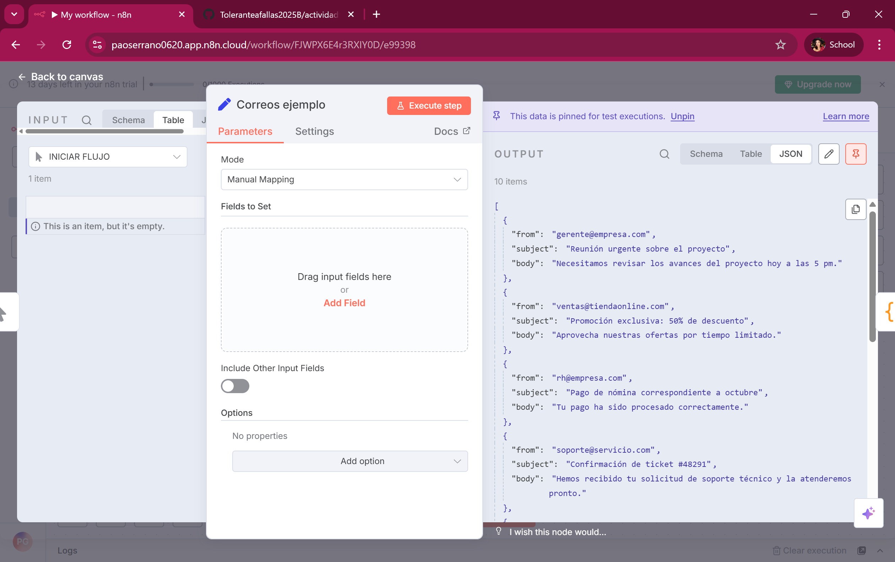

# Proyecto V1: Clasificador de Correos con N8N y MCP

## Descripción

Este proyecto simula un sistema de clasificación de correos electrónicos utilizando **N8N** para la automatización de flujos y un **LLM** a través de MCP para análisis de contenido. La idea principal es aprender a usar estas herramientas y simular un flujo de trabajo real, donde los correos se clasifican por **prioridad** y **categoría**.


---

## Flujo de Trabajo en N8N

### 1. Nodo Trigger (En este caso INICIAR FLUJO)

El Nodo Trigger es el punto de entrada de nuestro flujo en N8N. Su función principal es iniciar la ejecución del flujo automáticamente. En esta simulación, actúa como si recibiera correos electrónicos en tiempo real, disparando la ejecución para que los correos pasen por todos los nodos posteriores.
Este nodo nos permite aprender cómo N8N puede reaccionar a eventos externos, como la llegada de emails, sin necesidad de intervención manual.


---

### 2. Nodo Set

El Nodo Set se utiliza para definir los datos con los que vamos a trabajar dentro del flujo. En nuestro caso, configuramos un conjunto de correos electrónicos simulados en formato JSON, incluyendo campos como from (remitente), subject (asunto) y body (contenido del correo).
Este nodo es útil para pruebas y simulaciones porque nos permite crear datos controlados, reproducibles y sin depender de sistemas externos todavía.


Ejemplo de correos simulados:

```json
[
  {
    "from": "gerente@empresa.com",
    "subject": "Reunión urgente sobre el proyecto",
    "body": "Necesitamos revisar los avances del proyecto hoy a las 5 pm."
  },
  {
    "from": "ventas@tiendaonline.com",
    "subject": "Promoción exclusiva: 50% de descuento",
    "body": "Aprovecha nuestras ofertas por tiempo limitado."
  },
  {
    "from": "rh@empresa.com",
    "subject": "Pago de nómina correspondiente a octubre",
    "body": "Tu pago ha sido procesado correctamente."
  }
]
```




---

### 3. Nodo Code

El Nodo Code nos permite manipular los datos que fluyen por el sistema usando código (JavaScript o Python). En esta simulación, usamos el nodo para agregar dos campos extra a cada correo: prioridad y categoría.

prioridad clasifica los correos como Alta o Baja, dependiendo de la urgencia del asunto.

categoria agrupa los correos en temáticas, como Trabajo, Finanzas, Salud o General.

Esto nos ayuda a simular la inteligencia que un LLM (a través de MCP) podría aportar en un proyecto real, analizando el contenido del correo y asignándole etiquetas útiles para automatización futura.


Código utilizado:

```javascript
return items.map(item => {
  const email = item.json;
  let priority = "Baja";
  if (["Reunión urgente sobre el proyecto", "Aviso importante sobre tu cuenta bancaria", "Recordatorio de cita médica"].includes(email.subject)) {
    priority = "Alta";
  }

  let category = "General";
  if (["Reunión urgente sobre el proyecto", "Pago de nómina correspondiente a octubre", "Actualización del cronograma del proyecto Alfa"].includes(email.subject)) {
    category = "Trabajo";
  } else if (["Aviso importante sobre tu cuenta bancaria"].includes(email.subject)) {
    category = "Finanzas";
  } else if (["Recordatorio de cita médica"].includes(email.subject)) {
    category = "Salud";
  }

  return {
    json: { ...email, priority, category }
  };
});
```

---

### 4. Nodo IF

El Nodo IF nos permite tomar decisiones dentro del flujo según condiciones específicas. En nuestro proyecto, usamos el nodo para separar los correos en dos caminos: Prioridad Alta y Prioridad Baja.

La salida TRUE envía los correos de prioridad alta a un flujo especial.

La salida FALSE envía los correos de prioridad baja a otro flujo, manteniendo el orden y permitiendo posteriores acciones diferenciadas.

Esto simula cómo un sistema automatizado podría reaccionar distinto según la urgencia del correo y como podemos notar en la parte superior se dividio en la rama (branch) true y false.


---

### 5. Nodo Debug

El Nodo Debug es un nodo code que sirve para visualizar los resultados finales del flujo y verificar que todo funcione correctamente. Muestra los correos ya clasificados con sus campos priority y category.

Esto nos permite asegurarnos de que la simulación funciona tal como queremos antes de pasar a la siguiente etapa del proyecto (por ejemplo, integración con correos reales o creación de una interfaz de usuario).

Ejemplo de salida:


---

## Conclusión

Esta V1 permite **simular la clasificación automática de correos** usando **N8N** y conceptos de **MCP/LLM**, preparando el proyecto para la integración final con correos reales y acciones automatizadas.

