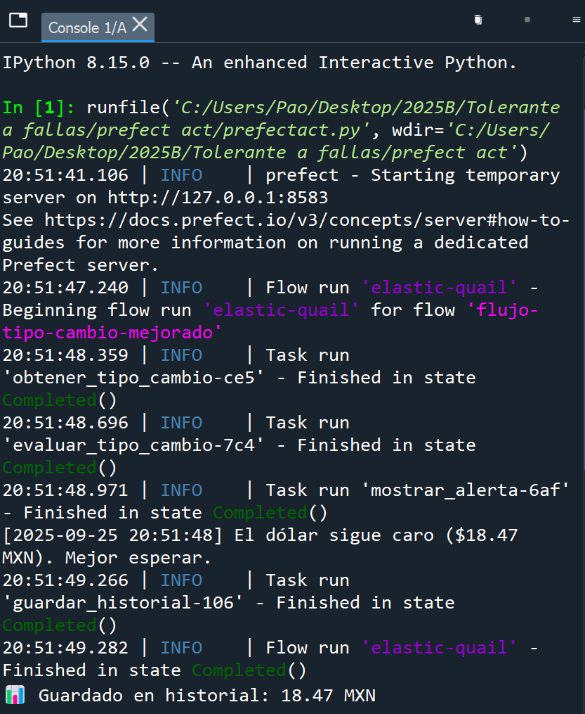
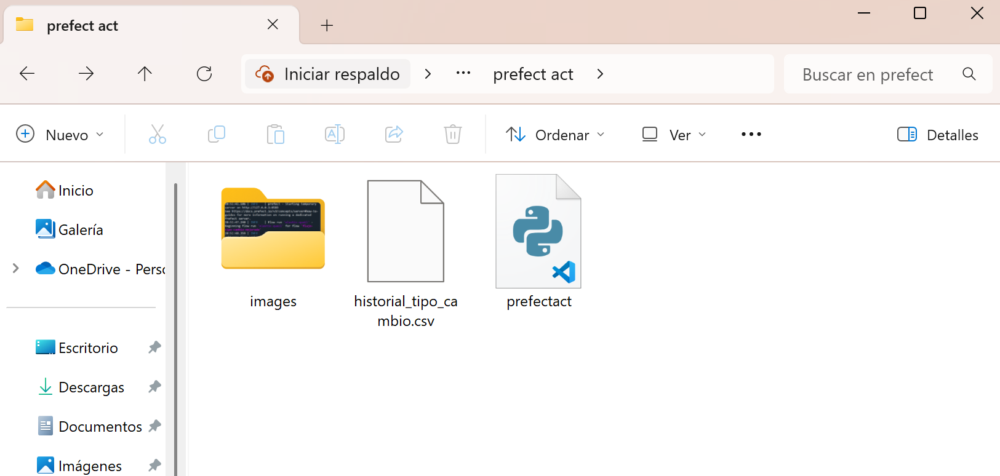
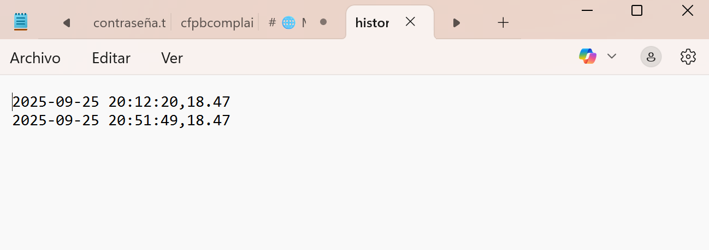

# 🌐 Monitoreo de Tipo de Cambio con Prefect

Este proyecto implementa un **flujo de Prefect** que consulta el tipo de cambio USD → MXN desde una API pública, evalúa si el dólar está barato o caro y genera alertas. Además, guarda un historial de valores en un archivo CSV para seguimiento.

---

## 📌 Funcionalidades

- Obtener el **tipo de cambio actual** USD → MXN.  
- Evaluar si el dólar está **barato o caro** según un precio objetivo.  
- Mostrar alertas en consola en tiempo real.  
- Guardar un **historial en CSV** de los tipos de cambio para análisis.  

---

## 🛠 Requisitos

- Python 3.10 o superior  
- Librerías Python:
  - `prefect`
  - `requests`

---

## 🚀 Cómo ejecutar

1. Abre tu terminal o Anaconda Prompt.  
2. Ve a la carpeta `actividadflujo` donde está tu script `prefectact.py`.  
3. Ejecuta el flujo:

```bash
python prefectact.py
-Se imprimirá en consola el tipo de cambio actual y la alerta correspondiente.
-Se generará o actualizará el archivo historial_tipo_cambio.csv con la fecha, hora y valor del dólar.

---

## 🖼 Ejemplo de salida en consola


## 🖼 Ejemplo del archivo .csv



