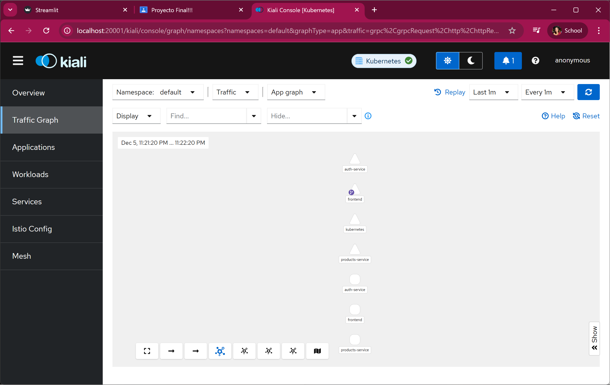
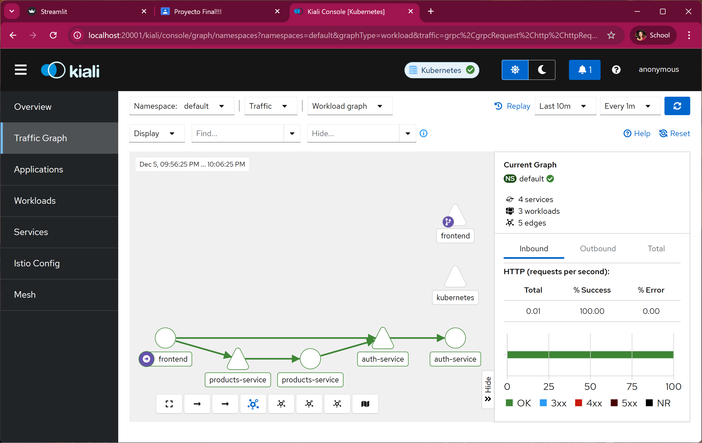
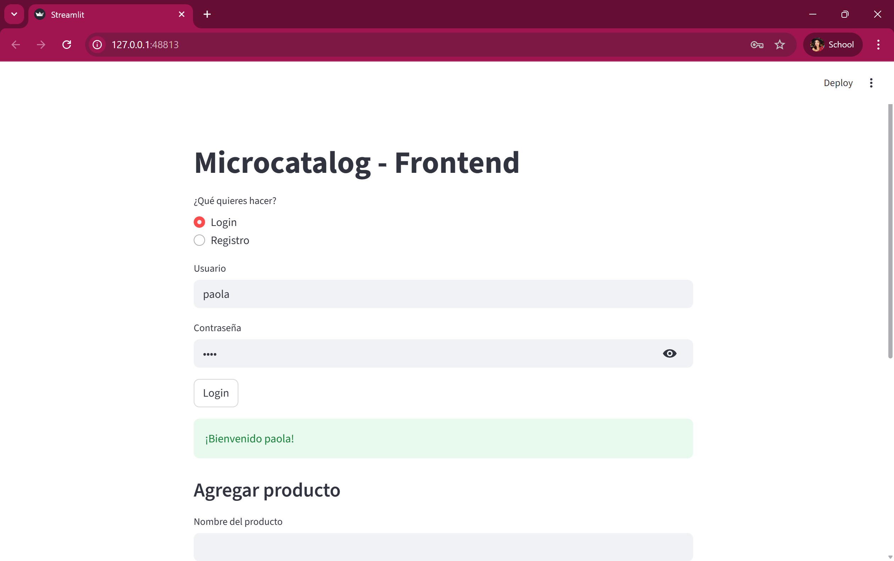
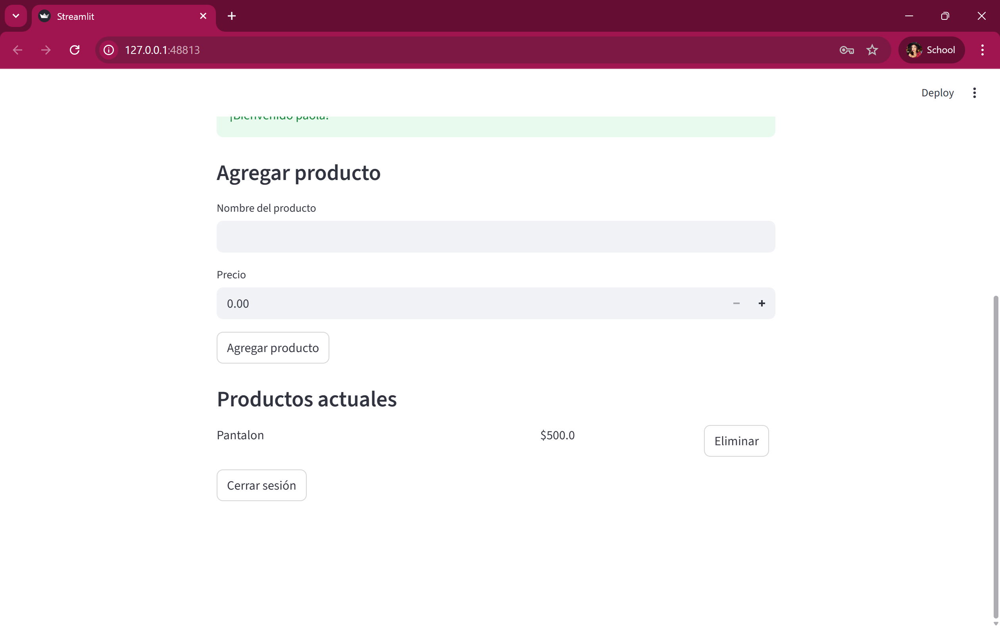
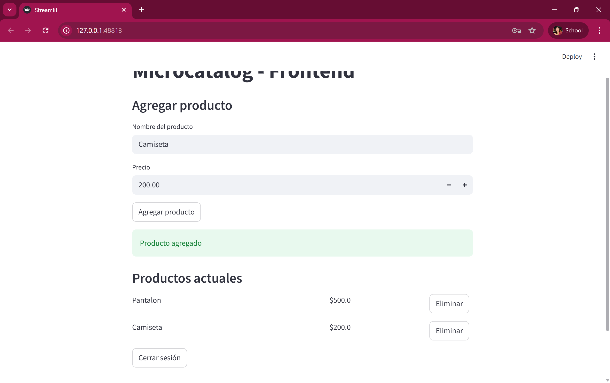
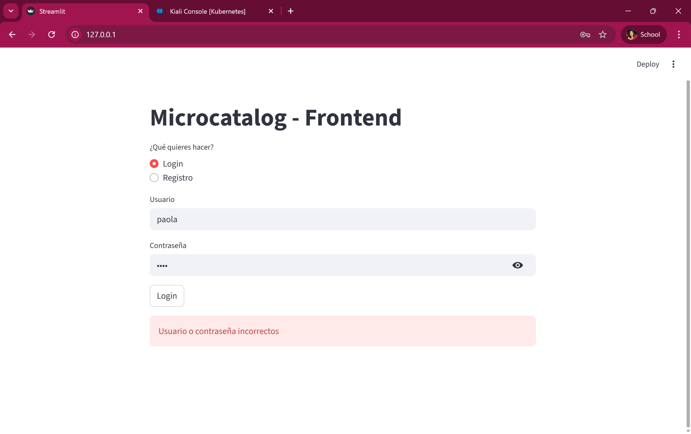
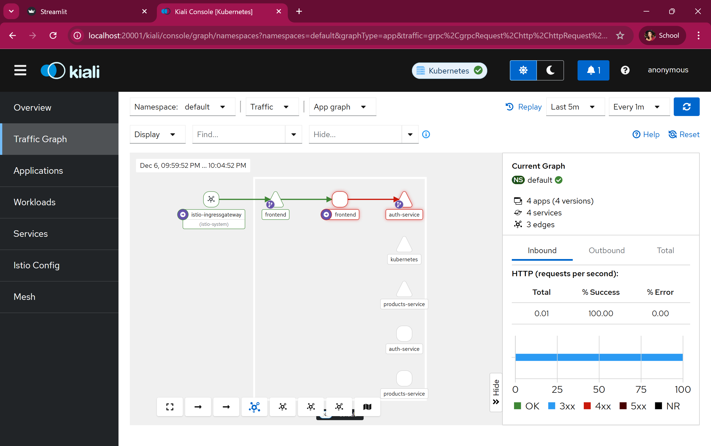

# Microcatalog  
### Arquitectura de Microservicios Tolerante a Fallas con Kubernetes e Istio

Proyecto desarrollado para la materia **Computación Tolerante a Fallas**, cuyo objetivo es diseñar, desplegar y validar una arquitectura basada en microservicios capaz de **soportar fallos parciales sin comprometer la disponibilidad del sistema**.

---

## 📌 Objetivo del Proyecto

- Implementar una arquitectura de microservicios modular y escalable.
- Garantizar tolerancia a fallas mediante Kubernetes e Istio.
- Analizar el comportamiento del sistema ante fallos controlados.
- Visualizar tráfico, errores y recuperación usando herramientas de observabilidad.

---

## 🧩 Arquitectura General

El sistema está compuesto por los siguientes microservicios:

- **Frontend:** Interfaz de usuario.
- **Auth Service:** Servicio de autenticación.
- **Products Service:** Gestión de productos.
- **Istio Service Mesh:** Gestión de tráfico, observabilidad y tolerancia a fallas.
- **Kubernetes:** Orquestación y recuperación automática.

### Diagrama de Arquitectura

---

## 🐳 Contenerización con Docker

Cada microservicio fue empaquetado en un contenedor Docker incluyendo:

- Código fuente
- Dependencias
- Configuración necesaria

Esto permite que cada servicio funcione de forma **independiente y aislada**.

---

## ☸️ Orquestación con Kubernetes

Kubernetes se encarga de:

- Despliegue de microservicios
- Balanceo de carga
- Reinicio automático de pods fallidos
- Escalabilidad del sistema

Los manifiestos de Kubernetes se encuentran en la carpeta:

/k8s

---

## 🔁 Comunicación entre Microservicios

- Los microservicios se comunican mediante **APIs REST**.
- Kubernetes provee descubrimiento de servicios.
- Istio monitorea y controla el tráfico interno.

---

## 🔐 Seguridad

- Autenticación centralizada mediante Auth Service.
- Comunicación controlada entre servicios.
- Separación de responsabilidades por servicio.

---

## 👀 Observabilidad con Istio y Kiali

Se utilizó **Kiali** para monitorear el comportamiento del sistema:

- Visualización de servicios
- Tráfico entre microservicios
- Latencia y errores
- Impacto de fallas inyectadas

### Vista general en Kiali

### Grafo de servicios

---

## 🧪 Pruebas Funcionales

### Login de usuario

### Gestión de productos

📸 Pantallas del frontend funcionando normalmente.

---

## 💥 Ingeniería del Caos (Chaos Engineering)

Se realizaron pruebas de **inyección de fallos controlados** utilizando Istio para evaluar la tolerancia a fallas del sistema.

### ⏱️ Inyección de Delay

- Se simuló latencia en el servicio de productos.
- El frontend continuó funcionando.
- Se observó incremento de latencia sin caída del sistema.

---

### ❌ Inyección de Errores (Abort)

- Se simuló una falla HTTP 503 en el Auth Service.
- El fallo fue aislado.
- El sistema permaneció disponible.

---

## 🔄 Recuperación ante Fallos

- Al eliminar pods manualmente, Kubernetes los recreó automáticamente.
- El tráfico se redirigió sin intervención del usuario.
- El sistema demostró alta disponibilidad.

---

## 🛠️ Guía de Despliegue

### Requisitos

- Docker
- Kubernetes (Minikube)
- Istio
- Kubectl

### Pasos generales de despliegue

minikube start  
istioctl install  
kubectl apply -f k8s/  
kubectl apply -f chaos/  

📌 Los pasos detallados se encuentran documentados en el proyecto.

---

## 📊 Resultados

- El sistema continúa operando ante fallas parciales.
- Los errores son detectados y visualizados en tiempo real.
- Se cumple con los principios de computación tolerante a fallas.

---

## ✅ Conclusiones

Este proyecto demuestra cómo una arquitectura basada en microservicios, apoyada por Kubernetes e Istio, puede ofrecer **resiliencia, observabilidad y tolerancia a fallas**, cumpliendo con los objetivos de la materia.

---

