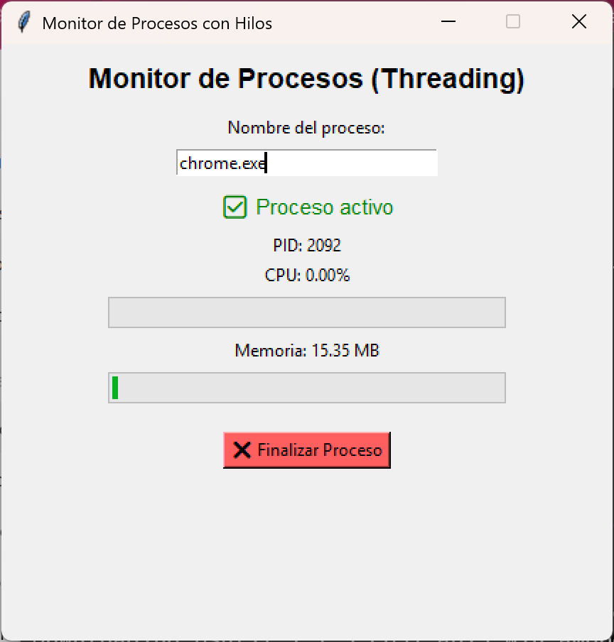
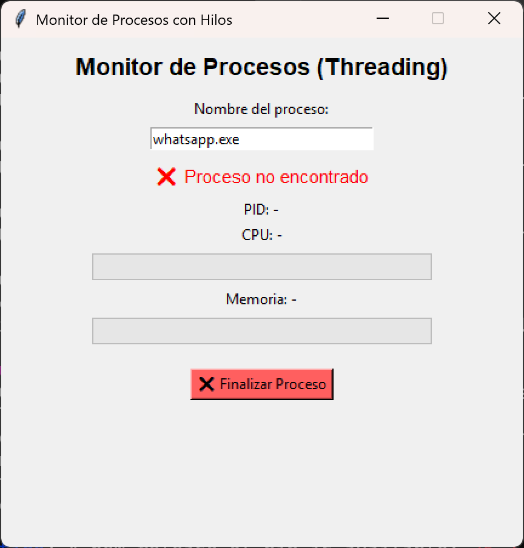
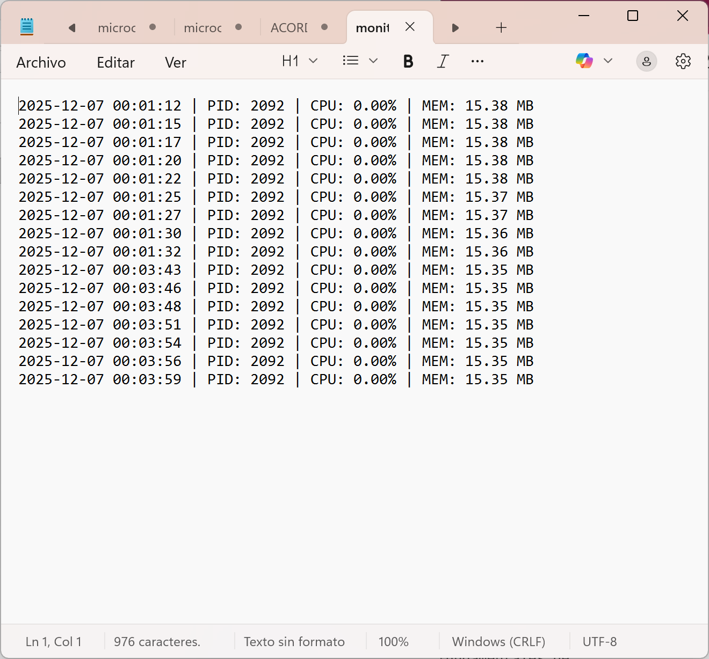

=============================================================
        MONITOR DE PROCESOS CON INTERFAZ GRÁFICA
        SISTEMAS OPERATIVOS – PYTHON / TKINTER
=============================================================

Autor: Paola Espinoza
Lenguaje: Python 3
Librerías: psutil, tkinter, threading

-------------------------------------------------------------
1. DESCRIPCIÓN GENERAL
-------------------------------------------------------------
Esta tarea consiste en el desarrollo de un programa que permite
monitorear procesos activos del sistema operativo mediante una
interfaz gráfica construida con Tkinter.

El programa muestra información relevante de un proceso específico,
como su identificador (PID), consumo de CPU y uso de memoria RAM,
además de permitir la finalización del proceso y el registro
histórico de su comportamiento.

El monitoreo se realiza utilizando hilos (threading), lo que asegura
que la interfaz gráfica permanezca responsiva mientras el sistema
realiza tareas de supervisión en segundo plano.

-------------------------------------------------------------
2. OBJETIVO
-------------------------------------------------------------
• Analizar la administración de procesos del sistema operativo.
• Obtener información en tiempo real del uso de CPU y memoria.
• Implementar concurrencia mediante hilos.
• Desarrollar una interfaz gráfica funcional.
• Aplicar conceptos de procesos, hilos y monitoreo de recursos.

-------------------------------------------------------------
3. FUNCIONALIDADES PRINCIPALES
-------------------------------------------------------------
✔ Selección manual del nombre del proceso
✔ Monitoreo en tiempo real
✔ Visualización de PID, CPU y memoria
✔ Barras de progreso para CPU y RAM
✔ Uso de hilos para la ejecución concurrente
✔ Finalización de procesos desde la interfaz
✔ Registro automático en archivo .txt
✔ Interfaz estable (no se congela)

-------------------------------------------------------------
4. TECNOLOGÍAS UTILIZADAS
-------------------------------------------------------------
• Python 3
• Tkinter (interfaz gráfica)
• psutil (monitoreo del sistema)
• threading (ejecución concurrente)

-------------------------------------------------------------
5. EJECUCIÓN DEL PROGRAMA
-------------------------------------------------------------
1. Abrir la carpeta del proyecto en Visual Studio Code.
2. Instalar la librería psutil si no está instalada:

   python -m pip install psutil

3. Ejecutar el archivo principal:

   python status.py

La interfaz gráfica se abrirá automáticamente.

-------------------------------------------------------------
6. USO DEL PROGRAMA
-------------------------------------------------------------
• Ingresar el nombre del proceso (ejemplo: notepad.exe, chrome.exe).
• El sistema comenzará a monitorear automáticamente.
• Se actualizarán los datos cada pocos segundos.
• El usuario puede finalizar el proceso con un botón.
• El historial se guarda en el archivo "monitor_procesos.txt".

-------------------------------------------------------------
7. USO DE HILOS (THREADING)
-------------------------------------------------------------
El monitoreo del proceso se ejecuta en un hilo secundario, mientras
que la interfaz gráfica corre en el hilo principal.

Esto evita el bloqueo de la interfaz gráfica y demuestra el uso de
concurrencia, permitiendo que múltiples tareas se ejecuten de forma
simultánea dentro de un mismo proceso.

-------------------------------------------------------------
8. CAPTURAS DE PANTALLA (SCREENSHOTS)
-------------------------------------------------------------

Pantalla principal del programa con el proceso activo.

Proceso no encontrado.

Archivo de registro generado (monitor_procesos.txt).

-------------------------------------------------------------
9. RESULTADOS
-------------------------------------------------------------
El programa cumple con los objetivos establecidos, permitiendo
visualizar y analizar el comportamiento de procesos del sistema
operativo en tiempo real, aplicando conceptos fundamentales de
administración de procesos, hilos y uso de recursos.

-------------------------------------------------------------
10. CONCLUSIÓN
-------------------------------------------------------------
Esta práctica permitió comprender de manera práctica cómo un sistema
operativo gestiona procesos y recursos. El uso de hilos fue clave para
garantizar la estabilidad del programa, mientras que la interfaz
gráfica facilitó la interacción con el usuario.

El proyecto demuestra la integración efectiva entre teoría y práctica
en el área de Sistemas Operativos.

=============================================================
