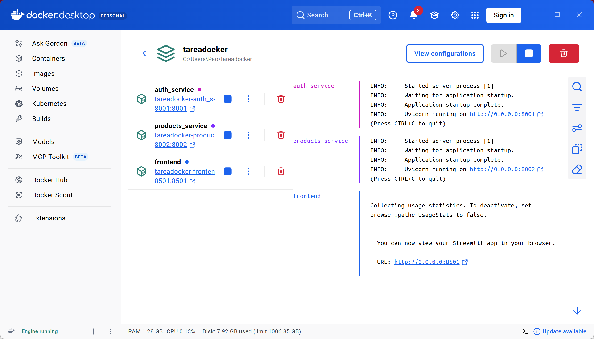
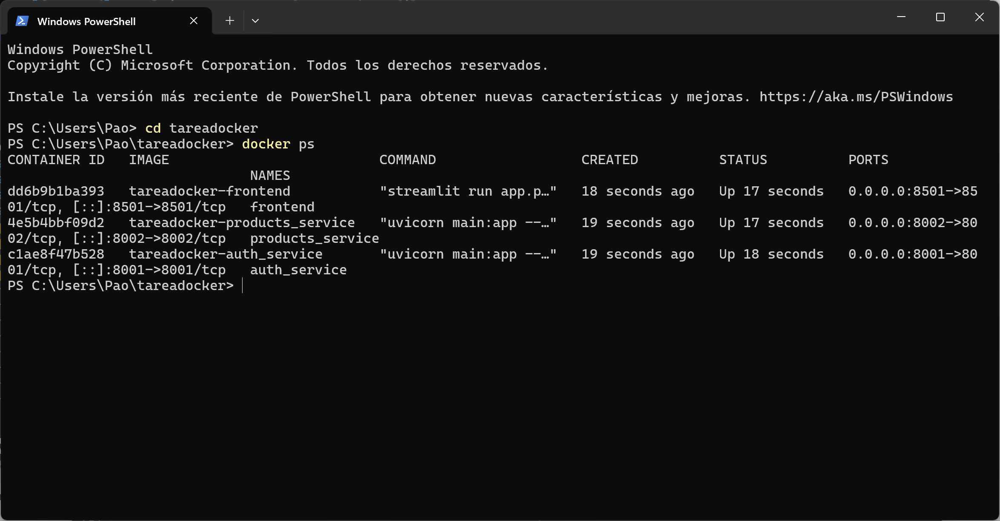
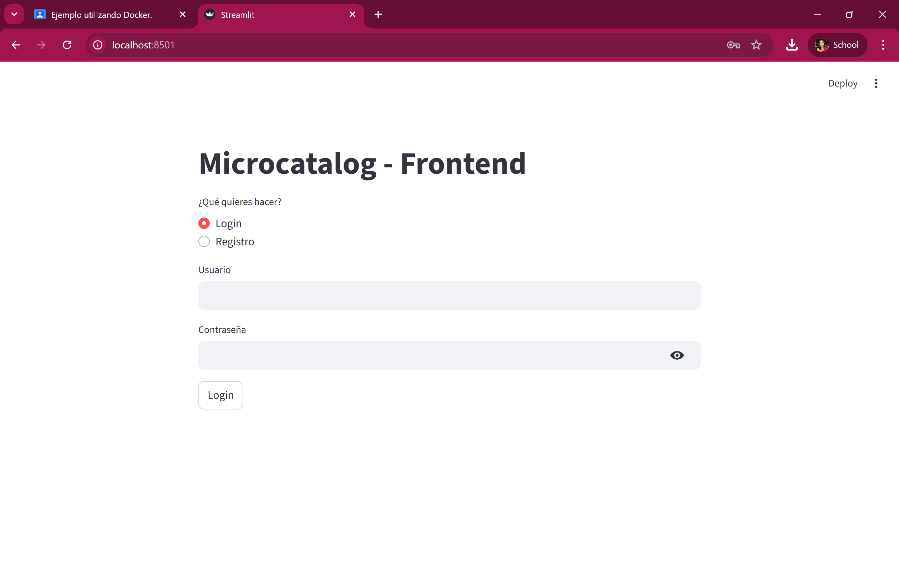

====================================================
EJEMPLO UTILIZANDO DOCKER
====================================================

====================================================
1. DESCRIPCIÓN
====================================================

Esta tarea consiste en una aplicación basada en una arquitectura de microservicios, contenedorizada utilizando Docker. La aplicación está dividida en tres servicios
independientes:

- auth_service: Servicio de autenticación de usuarios.
- products_service: Servicio para la gestión de productos.
- frontend: Interfaz gráfica web para interactuar con la aplicación.

Cada microservicio se ejecuta en su propio contenedor Docker, permitiendo un diseño
modular, desacoplado y escalable.

====================================================
2. TECNOLOGÍAS UTILIZADAS
====================================================

- Docker
- Docker Compose
- Python
- FastAPI
- Streamlit

====================================================
3. ESTRUCTURA DEL PROYECTO
====================================================

El proyecto tiene la siguiente estructura:

/auth_service
  └ Dockerfile
  └ main.py
  └ users.json

/products_service
  └ Dockerfile
  └ main.py
  └ products.json

/frontend
  └ Dockerfile
  └ app.py

docker-compose.yml

====================================================
4. DESCRIPCIÓN DE LOS MICROSERVICIOS
====================================================

AUTH SERVICE:
- Se encarga de la autenticación de usuarios.
- Expone el servicio en el puerto 8001.
- Utiliza persistencia mediante un archivo JSON.

PRODUCTS SERVICE:
- Administra la información de los productos.
- Se comunica con el servicio de autenticación.
- Expone el servicio en el puerto 8002.

FRONTEND:
- Interfaz gráfica para el usuario.
- Permite iniciar sesión y gestionar productos.
- Se ejecuta en el puerto 8501.

====================================================
5. ARCHIVO docker-compose.yml
====================================================

Docker Compose se utiliza para orquestar los tres microservicios y facilitar su despliegue.

El archivo docker-compose.yml permite:
- Construir las imágenes automáticamente.
- Levantar todos los microservicios con un solo comando.
- Establecer dependencias entre servicios.
- Mantener persistencia de datos mediante volúmenes.

====================================================
6. DESPLIEGUE DEL PROYECTO
====================================================

Para ejecutar el proyecto, seguir los siguientes pasos:

1) Abrir PowerShell en la carpeta raíz del proyecto.

2) Construir y levantar los contenedores con el comando:

docker-compose up --build

3) Verificar que los contenedores estén en ejecución con:

docker ps

4) Acceder a los servicios desde el navegador:

- Frontend: http://localhost:8501
- Auth Service: http://localhost:8001
- Products Service: http://localhost:8002

====================================================
7. RESULTADOS OBTENIDOS
====================================================

El proyecto se ejecuta correctamente utilizando Docker, logrando:

- Separación clara de responsabilidades.
- Comunicación entre microservicios.
- Facilidad de despliegue y ejecución.
- Base sólida para escalar a Kubernetes.

====================================================
8. CONCLUSIÓN
====================================================

El uso de Docker permitió empaquetar cada microservicio de forma independiente,
asegurando portabilidad y facilidad de despliegue. Esta arquitectura facilita
la escalabilidad, el mantenimiento y sienta las bases para una arquitectura tolerante
a fallos y orquestada posteriormente con Kubernetes.

